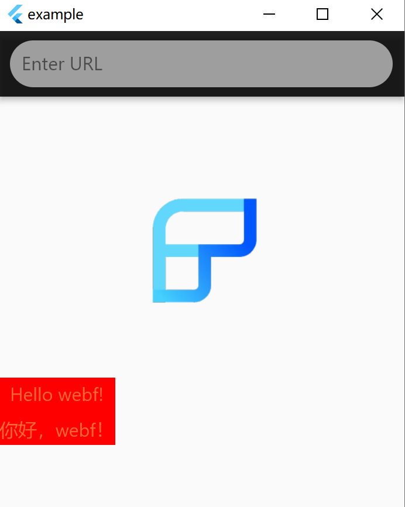

Unnoticeably, it has been a year and a half since WebF separated from the Kraken project and was established. During
this time, we've been busy maintaining the community team and updating the code under various prompts.

Today, through this article, we want to update everyone on what we have done from the establishment of WebF in July 2022
to now, and what we are still lacking to achieve our final goal.

The last official version of Kraken, [version 0.11](https://github.com/openkraken/kraken/releases/tag/0.11.0), was
released in April 2022. The subsequent versioning of WebF
continues this setting, so the first official version of WebF
is [0.12.0](https://github.com/openwebf/webf/releases/tag/0.12.0), released in August 2022. However, most updates
have been concluding the work of Kraken before its maintenance stopped.

The real updates for WebF, starting from 0.13.0, are as follows:

## 0.13.0

In the second half of 2022, WebF had two main tasks: a complete overhaul and renovation of the bad parts of the existing
Kraken, which, while solving some stubborn problems, significantly improved the performance of some modules. Another
task was to cultivate a new community development team, through bi-weekly intensive sharing sessions, to allow new
members to quickly familiarize themselves with the original Kraken project code and join in the project iteration.

After four months of uninterrupted development and iteration, the first major version update of WebF brought stunning
improvements:

### 2x-5x performance improvement in DOM API

Complete rewriting of all Kraken's existing Binding & DOM code

Reimplementation of the DOM tree using a double-linked list as the core data structure, significantly improving the
performance of DOM node operations:

+ Node.appendChild achieved a 2x performance improvement
+ Node.insertBefore achieved a 5x performance improvement

### Designed a memory management mechanism based on QuickJS, significantly improving stability

In the past, the C++ code in Kraken used manual memory management for the DOM tree and JavaScript API, which was prone
to memory bugs.

Facing the support of over a hundred DOM APIs, manual maintenance was undoubtedly a breeding ground for
bugs. In the new version's reconstruction, we customized a fully automatic memory management mechanism for the C++ DOM
implementation based on the characteristics of QuickJS — tying the life cycle of JavaScript objects to C++ objects, and
automatically completing the creation and destruction of related resources through QuickJS GC.

This memory management mechanism, built on QuickJS GC, prevented any C++ DOM crashes in various special scenarios
throughout 2023.

### CSS Selector & Animation Support

In the Kraken era, front-end developers could only control styles through inline styles. After WebF was established, we
changed the project's direction to support CSS selectors directly like browsers.

Thanks to [devjiangzhou](https://github.com/devjiangzhou)'s strong support,
his first version directly supported all common selectors and nearly 10 pseudo-classes.

With this foundation, front-end developers can influence the style of DOM elements by introducing a piece of CSS code
through <link /> or <style /> tags, just like in browsers.

This version also added support for @keyframe and CSS animation, for which we thank the outstanding contribution from
the front-end team of Tencent's Honor of Kings.

### A Brand New Flutter Widget Adapter

As a web rendering engine built on Flutter, connectivity with the existing Flutter ecosystem is also an important part.
Due to some limitations in Kraken's existing Flutter Widget adapter, it could not support all types of Flutter Widgets.

Therefore, We also made significant improvements to the original adapter, supporting multiple nesting and optimizing the
performance of custom tag attribute reading operations.

## 0.14.0

0.14.0 represents a leap in WebF's first official version in 2023. With WebF's trial and online validation in our VIP
customers' companies in the first half of 2023, we collected a lot of application cases and actual production
data. Based on this feedback, we further iterated and updated WebF's functionality.

### 40% performance improvement in QuickJS

With the contribution of [ErosZy](https://github.com/ErosZy), we significantly optimized the QuickJS provided by the
officials. Not only did we fix the issue of missing column numbers in error stacks, but we also added Inline Cache
support based on the existing code.

Meanwhile, the overall runtime efficiency improved by nearly 40%:

|               | bellard/quickjs (2788d71) | openwebf/quickjs (latest) |
|---------------|---------------------------|---------------------------|
| Richards      | 1188                      | 1457                      |
| Crypto        | 1443                      | 1527                      |
| RayTrace      | 744                       | 1995                      |
| NavierStokes  | 2775                      | 2979                      |
| DeltaBlue     | 1100                      | 1595                      |
| Total score   | 1312                      | 1840 (+40.2%)             |
| File Size(KB) | 1.3M                      | 1.4M                      |

### Windows Platform Support

By making QuickJS compatible with Windows platform builds, the QuickJS maintained by WebF team can now be compiled and
built
using MSVC compiler, and Flutter has long provided support for the Windows platform.

### Partial SVG Support

As the community team gradually got the hang of the Kraken project code, [XGHeaven](https://github.com/XGHeaven) from
ByteDance submitted basic
support for SVG. Since then, some SVG-based fonts and icons can be directly displayed in WebF. Thanks to this colleague
for his contribution and support to the WebF project.

The first batch of implementations supported the following five SVG tags:

+ `<svg>`
+ `<rect>`
+ `<path>`
  + `<d>`
+ `<text>`
+ `<g>`

### Numerous API additions and Bug Fixes

Through our exploration of common business codes, WebF supported very commonly used APIs in its own
business in 0.14.0:

+ window.getComputedStyle [Jiangzhou](https://github.com/devjiangzhou)
+ localStorage and sessionStorage
+ atob and btoa
+ Element.classList
+ CanvasRenderingContext2D.createLinearGradients and createRadialGradient
+ Element.querySelectorAll and Element.querySelector
+ document.domain
+ Element.dataset
+ Element.match
+ Element.closest

We also adapted the Vue SSR function, and now businesses based on Vue SSR can run directly on WebF.

In addition, we fixed 58 various issues, which can be seen in the 0.14.0 ChangeLog.

Also, in the 0.14.0 version, several WebF contributors joined,
including [answer-huang](https://github.com/answer-huang), [suyulin](https://github.com/suyulin), [Storm-M](https://github.com/Storm-M),
[calvinchengx](https://github.com/calvinchengx),
[hzbhzb](https://github.com/hzbhzb), and [zjt123](https://github.com/zjt123).

## 0.15.0

### Support for Event Delegation

The VipShop team, during their use of WebF, found that there were a lot of codes in the business based on event
delegation. So they specifically allocated manpower and time to help WebF support the event delegation function. Now
WebF's EventTarget.addEventListener also supports passing true as the third parameter to monitor an event delegation
operation. We thank the VipShop client team for their outstanding contribution.

### More SVG Tags and CSS Capability Support

[XGHeaven](https://github.com/XGHeaven) spent some time in this version adding support for two new SVG
tags: `<circle />` and `<ellipse>`.

This version also added support for `@font-face` and ::before and ::after. With these capabilities, front-end developers
can dynamically load some font files or display various patterns through SVG.

### Fixing More Issues and Discovering More Problems

As the application scenarios gradually deepened, WebF fixed more discovered issues along the way. Through actual
business case studies, we identified current fatal weaknesses in the WebF system, which will profoundly impact
subsequent version iterations.

Also, in the 0.15.0 version, several more WebF contributors joined,
including [jinwencan](https://github.com/jinwencan), [AlexV525](https://github.com/AlexV525), [looseyi](https://github.com/looseyi),
[xxrlzzz](https://github.com/xxrlzzz), and
[penneryu](https://github.com/penneryu).

## The Upcoming 0.16.0

### Support for MutationObserver

MutationObserver plays a very important role in some special scenarios, and only by providing a native implementation
can we simultaneously take care of performance and full functionality.

The MutationObserver feature is now stable and available on the main branch.

### Dedicated Thread Mode

After analyzing various actual business, we found that front-end business's JS code occupies most of the process of
loading and updating a page. Since Kraken adopts a single-thread architecture, with JS execution and Dart/Flutter
running entirely on the same thread, having front-end virtual DOM calculations run on QuickJS, which is much slower
compared to JIT engines like V8, severely affects UI updates and rendering, leading to visible stuttering.

Therefore, we also introduced a multi-thread architecture similar to React-Native and Mini-Programs — executing JS on an
independent thread. Even if JS execution takes hundreds of ms, it won't affect users' scrolling and UI drawing, making
it feel smooth.

In subsequent WebF versions, dedicated thread mode will be the default feature, while also retaining the original
single-thread running mode.

### Preloading and Offscreen Rendering Modes

When using WebView to load a page, the most common performance optimization techniques are WebView preheating and page
preloading. WebF also provides an API for preloading functionality, similar to this feature. Developers only need to
trigger preloading in advance, so that when the page is opened, the page code can be executed and the page rendered
immediately without the need for network access.

Compared to basic preloading functions, WebF offers even greater optimization potential than WebView. Unlike WebView's
implementation of offscreen rendering, which consumes a large amount of memory resources, WebF can halt the page loading
process at the stage before rendering, preserving the current state.

When users actually enter the page, the execution of JS/CSS/HTML in the page is skipped, and it directly enters the
rendering process. Tests have shown that this can
effectively **reduce about 90% of the initial screen load time**, allowing users to see the complete page content almost
instantly without any blank screen.

This feature is currently in the verification and testing phase, and it is believed that soon, in the official 0.16.0
version, everyone will be able to experience this ultimate loading functionality.

## What's next?

WebF still has some way to go before it becomes a fully supported, high-performance, stable, and user-friendly version
for the web ecosystem, with current progress at about 72%.

In 2024, WebF will continue to develop in this direction. The known new features planned include:

+ CSS/Style Support 2.0: Rewriting the existing Dart code in C++ to elevate the performance of CSS selectors to the same
  level as browsers.
+ Support for Multiple JavaScript Engines such as V8/JavaScriptCore: The newly restructured Bindings have reserved
  interfaces for multi-engine support. We will offer a choice of different JavaScript Engines to suit various business
  scales and application scenarios.
+ Native Rust Support: Providing native performance for Rust applications in DOM/Web APIs while maintaining dynamism,
  allowing Rust web applications to run natively on Flutter.
+ Hybrid Routing Support: Current web applications and client/Flutter routing are disjointed. We plan to offer a
  customized version of Vue-Router or React-Router, turning each subpage into a complete Flutter page.
+ StackingContext Support: Similar to browser-like z-index support.
+ Rich Text Layout Support: Supporting mixed layout of text and images, multi-layered and multi-line inline elements.