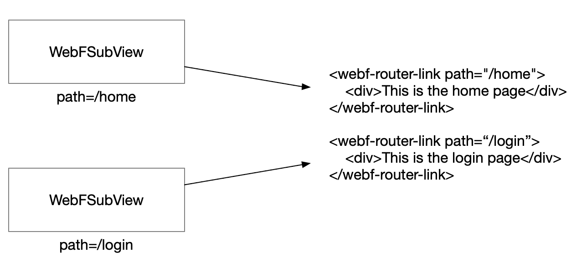

# Hybrid Routing in WebF

The Hybrid Routing system is a new routing mechanism that leverages Flutter's navigation state and animations instead of relying on third-party JavaScript routing libraries like Vue Router or React Router.

Any routed page created by the hybrid router is automatically recognized by Flutter and can be navigated via Dart using `Navigator.pushNamed()`, along with built-in swipe gestures and animations—just like any other standard Flutter page.

By using the hybrid router in WebF Enterprise, developers can easily create native-like subpages using HTML and JavaScript while seamlessly integrating with standard Flutter pages.

## Getting Started

To set up the hybrid router in WebF, you need to configure the router settings on both the Front-End and Flutter sides.

### 1. The `<webf-router-link />` Element

The `<webf-router-link />` element serves as the entry point for different routing pages in the Hybrid Router.

You need to define the `path` attribute for each `<webf-router-link />` to specify the route name:

```html
<webf-router-link path="/register">
    <div>This is the Register page</div>
</webf-router-link>
<webf-router-link path="/login">
    <div>This is the Login page</div>
</webf-router-link>
<webf-router-link path="/home">
    <div>This is the Home page</div>
</webf-router-link>
```

### 2. The `WebFSubView` Widget

The `WebFSubView` widget acts as the root widget, rendering content for each hybrid routing page.

```dart
WebFSubView(title: 'The Home Page', path: '/home', controller: controller!)
```

Each `WebFSubView` requires the `path` attribute, which must match the corresponding `path` value defined in `<webf-router-link />`. When this widget is mounted to the Flutter widget tree, the children inside `<webf-router-link />` are rendered as the children of the `WebFSubView` widget.



#### 2.1 Integrating `WebFSubView` with Flutter's Routing System

Integrating the `WebFSubView` widget with Flutter's built-in routing system is simple. You can register paths in the `MaterialApp` widget as follows:

```dart
MaterialApp(
  title: 'WebF Example App',
  initialRoute: '/',
  routes: {
    '/home': (context) => WebFSubView(title: 'The Home Page', path: '/home', controller: controller!),
    '/register': (context) => WebFSubView(title: 'The Register Page', path: '/register', controller: controller!),
    '/login': (context) => WebFSubView(title: 'The Login Page', path: '/login', controller: controller!),
  },
  home: FirstPage(title: 'Landing Bay', controller: controller!),
)
```

Now, you can navigate to different subviews from Flutter to WebF using the following Dart code:

```dart
Navigator.pushNamed(context, '/home');
```

#### 2.2 Setting the Default Routing Path in WebF

When initializing the `WebFController`, you can set the `initialRoute` value to configure the default routing page for the hybrid router:

```dart
WebFController(
  context,
  initialRoute: '/home', // Set the home page as the default
);
```

## Optimization Tips: Reducing Unnecessary DOM Nodes

By default, WebF creates all DOM nodes for hybrid router pages, even if only one of them is rendered initially.

Creating unnecessary DOM nodes at startup can significantly affect loading performance, especially for complex apps with many routes.

### **Example of Unoptimized Code (Poor Performance)**

The following code will create all DOM nodes at startup, leading to poor loading performance:

```html
<webf-router-link path="/register">
    <div>This is the Register page</div>
</webf-router-link>
<webf-router-link path="/login">
    <div>This is the Login page</div>
</webf-router-link>
<webf-router-link path="/home">
    <div>This is the Home page</div>
</webf-router-link>
```

### Using the `mount` and `unmount` Events in `<webf-router-link />`

The `mount` and `unmount` events are triggered when a route is mounted or unmounted from the rendering tree:

- **`mount`**: Fired when the user navigates to this page; the children of `<webf-router-link />` become visible.
- **`unmount`**: Fired when the user navigates away; the children of `<webf-router-link />` are removed.

Front-End developers should use event listeners on `<webf-router-link />` elements to dynamically insert DOM nodes, reducing unnecessary initialization overhead.

#### **Optimized Example Using Vue.js**

```vue
<template>
  <webf-router-link path="/register" @mount="handleRouterMounted('register')">
    <div v-if="activeRouter === 'register'">This is the Register page</div>
  </webf-router-link>
  <webf-router-link path="/login" @mount="handleRouterMounted('login')">
    <div v-if="activeRouter === 'login'">This is the Login page</div>
  </webf-router-link>
  <webf-router-link path="/home">
    <div>This is the Home page</div>
  </webf-router-link>
</template>

<script>
export default {
  data() {
    return {
      activeRouter: '',
    };
  },
  methods: {
    handleRouterMounted(page) {
      this.activeRouter = page;
    },
  },
};
</script>
```

## Navigating Routes in JavaScript

Front-End developers can use APIs from `window.webf.hybridHistory` to navigate between routes, go back, and retrieve the current state object.

### **Navigating to Another Hybrid Route**

To navigate to a new hybrid route with path `/share_link`, execute the following JavaScript code with a state object:

```javascript
// Navigate to a new page defined in `<webf-router-link path="/share_link" />`
// or a native Flutter page registered with the '/share_link' path.
window.webf.hybridHistory.pushState({ id: this.item.item.id }, '/share_link');
```

### **Navigating Back to the Previous Route**

```javascript
window.webf.hybridHistory.back();
```

### **Retrieving the Current State Object**

To get the state data from the previous route:

```javascript
console.log(window.webf.hybridHistory.state); // { id: '<id>' }
```