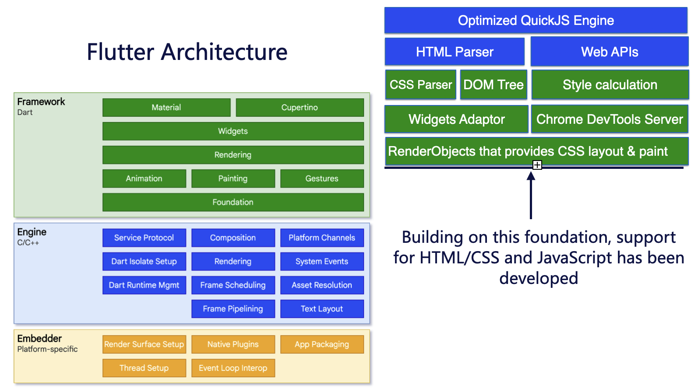

This guide was designed for developers who have experiences of Flutter development.

WebF offers enhanced customization and optimization for web applications. It ensures that your application runs
seamlessly, behaving more like native Flutter apps.

## How to Use this guides

This guides will provide a brief introduction to WebF, and it's divided into topics to teach you how to customize the
optimize WebF apps.

If you desire features that may not be provided by WebF, please submit an issue to us.

## How WebF works in Flutter

WebF is a rendering engine built on the foundation of Flutter's rendering framework.

It extends the Flutter RenderObject class to achieve the layout and painting capabilities required by CSS Style and
implements the DOM tree and various CSS selectors.

Through Dart's FFI, WebF integrates QuickJS to execute JavaScript. With comprehensive support for Web APIs, it allows
you to drive web frameworks and applications directly without the need for any polyfills or adaptors.

WebF also incorporates a debugging service that is compatible with the Chrome DevTools Protocol.

This allows web developers to connect to WebF through Chrome DevTools and use Chrome DevTools to debug WebF pages just
like regular web pages.

There is an architecture overview.

## The relationship between WebF and Flutter

WebF offers Flutter developers a single WebF widget to render web content alongside Flutter apps.

Integrating WebF into Flutter apps is as straightforward as using other widgets, and you can place WebF anywhere within
your Flutter application.

Using multiple WebF instances within the same Flutter app is also supported. Each WebF widget has its own rendering
context and JSContext, similar to separate pages in web browsers.

## When and how to use WebF in your Flutter apps

When to use WebF:

1. You want certain parts of your app to be dynamically updated (without reinstalling the app).
2. You want to deploy your application across various platforms, including mobile, desktop, and mini-app (specific to
   mainland China).
3. Your team comprises numerous developers who are proficient in web development but not in Flutter or Native.
4. You are seeking a WebView replacement to running your web app inside your app for performance reasons.

How to use WebF:

1. WebF was designed for developer who have experienced with web development, make sure you and your team are familiar
   with web development before using WebF.
2. WebF was meticulously designed to be compatible with web browsers, striving to maintain compatibility with the
   existing web development ecosystem. While the features and tools for web development encompass a vast collection with
   hundreds of APIs, supporting these libraries remains a significant task, and we still have more work ahead. So be
   patience and let us known and keeping up the date with WebF if you want your favorite web libraries to be working in
   WebF.
3. The primary advantage of WebF over WebView lies in its capability to integrate any Flutter widget within WebF apps.
   This feature allows you to tap into the expansive Flutter development ecosystem, combining the best of both Flutter
   and the Web. To make the most of this, try using the `WidgetElement` to encapsulate your preferred Flutter widgets and
   incorporate them into your WebF web applications
