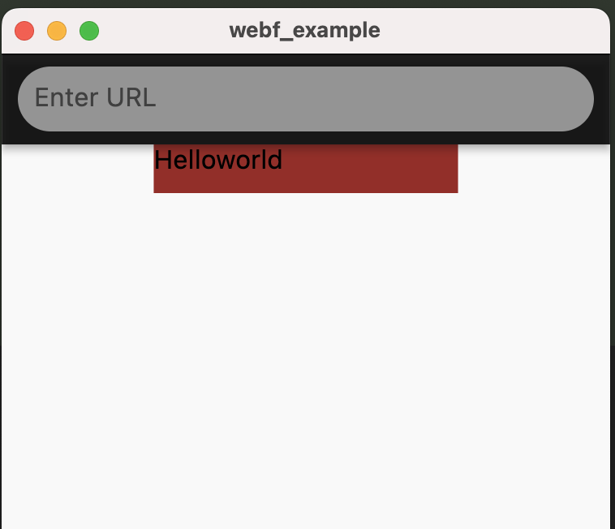
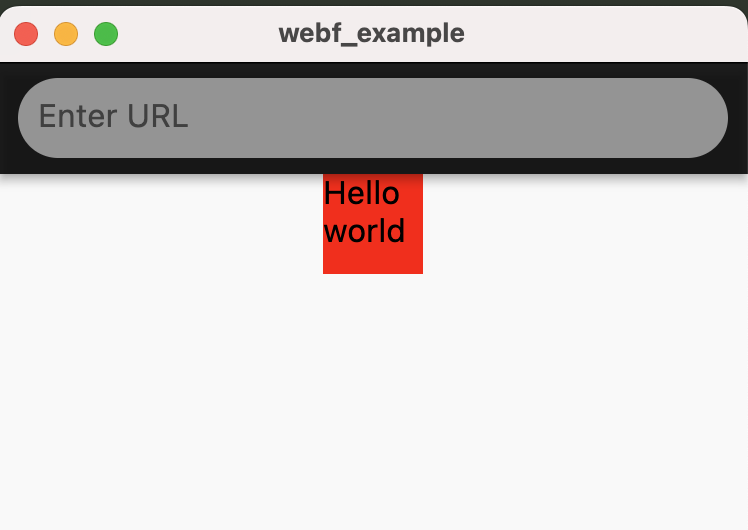
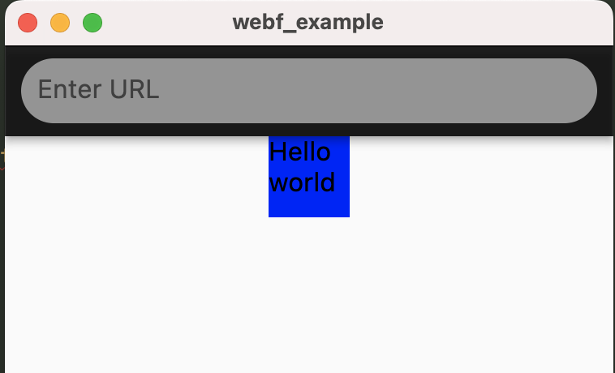
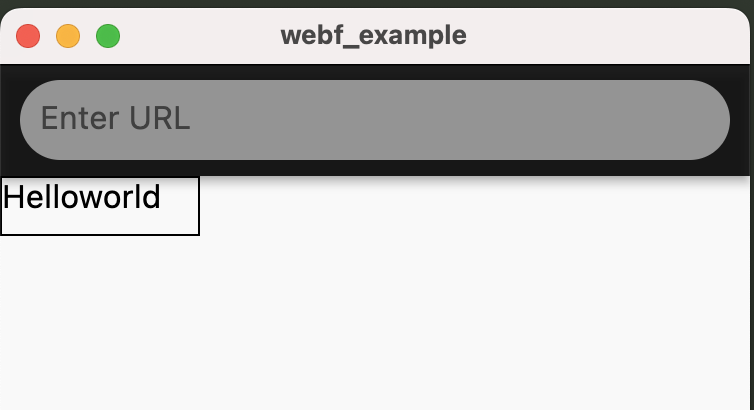
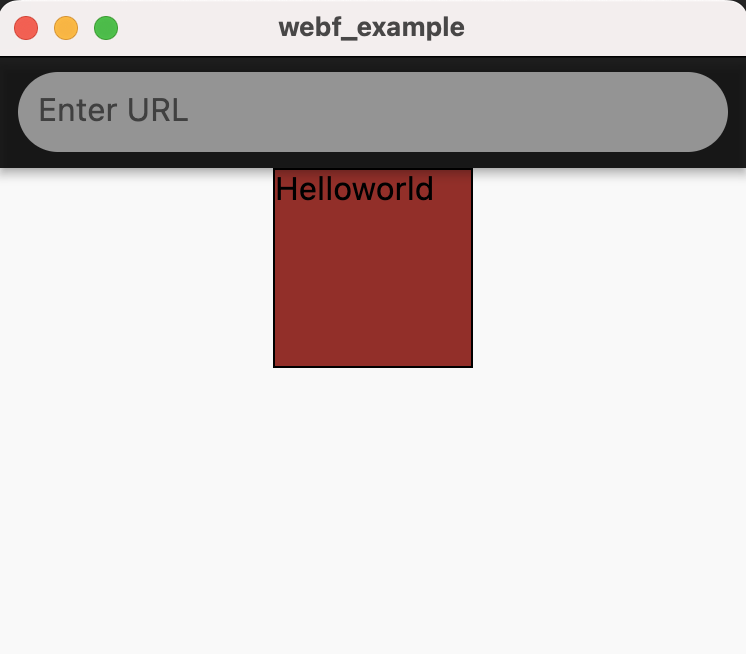
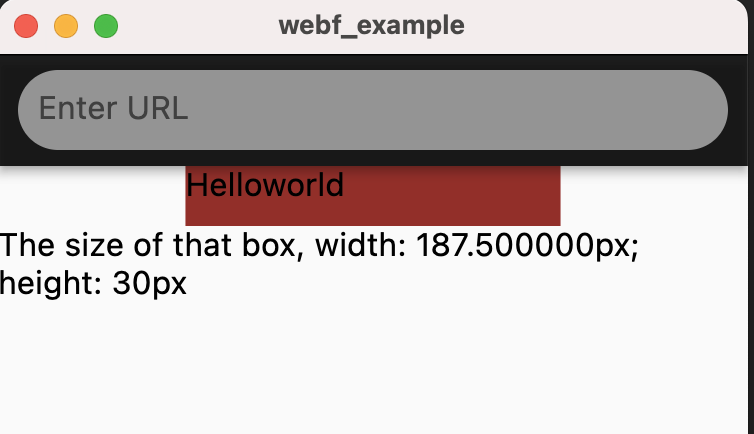

CSS code can be used in multiple ways in web browsers, and most of them are supported in WebF.

## Applying CSS in HTML

### Using CSS via `<link />` element

CSS code can be downloaded and applied to your elements with `<link />` element, which is a popular way to apply CSS in
web pages.

**Example**

If we have a `style.css` files that contains the following CSS codes:

```css
 :root {
    --main-bg-color: brown;
    --main-width: 25vw;
    --size-ratio: 2;
}

.container {
    width: calc(var(--main-width) * var(--size-ratio));
    height: 30px;
    margin: 0 auto;
    background: var(--main-bg-color);
}
```

You can load this css file using the following codes:

```html
<!DOCTYPE html>
<html>
<head>
    <link rel="stylesheet" href="./style.css">
</head>
<body>
<div class="container">
    Helloworld
</div>
</body>
</html>
```

That HTML will be the following result in WebF and acting the same as in web browsers:



### Using CSS via `<style />` element

CSS code can be embedded into HTML directly via `<style />` elements, without send a network request for downloading.

The previous example can also be implemented by the following codes.

```html
<!DOCTYPE html>
<html>
<head>
    <style>
        :root {
            --main-bg-color: brown;
            --main-width: 25vw;
            --size-ratio: 2;
        }

        .container {
            width: calc(var(--main-width) * var(--size-ratio));
            height: 30px;
            margin: 0 auto;
            background: var(--main-bg-color);
        }
    </style>
</head>
<body>
<div class="container">
    Helloworld
</div>
</body>
</html>
```

### Apply styles with inline style

Inline styles are also supported in WebF, and they have a higher priority than styles from `<style />` and `<link />`
elements.
In later chapter, we will delve into more details about the cascading support of CSS in WebF.

Here is an example demonstrating how inline styles overwrite the styles defined in a `<style />` element:

```html
<!DOCTYPE html>
<html>
<head>
    <style>
        :root {
            --main-bg-color: brown;
            --main-width: 25vw;
            --size-ratio: 2;
        }

        .container {
            width: calc(var(--main-width) * var(--size-ratio));
            height: 30px;
            margin: 0 auto;
            background: var(--main-bg-color);
        }
    </style>
</head>
<body>
<div class="container"
     style="
      width: 50px;
      height: 50px;
      background: red;">
    Helloworld
</div>
</body>
</html>
```

And here is the results in WebF:



## Applying CSS in JavaScript

### Update styles in Vue.js

Most of the time, it's not necessary to manipulate the DOM properties directly.

If you're using Vue.js, you can refer to this [guide](https://vuejs.org/guide/essentials/class-and-style.html) and let
Vue.js handle these tasks for you.

### Update styles in React.js

React.js is also supported, you can refer to this [guide](https://legacy.reactjs.org/docs/faq-styling.html) for more
details.

### Setting inline styles via DOM API

You can use the [style](https://developer.mozilla.org/en-US/docs/Web/API/HTMLElement/style) property from
the [HTMLElement](https://developer.mozilla.org/en-US/docs/Web/API/HTMLElement) to set inline styles for that element.

**Example:**

```html
<!DOCTYPE html>
<html>
<head>
    <style>
        :root {
            --main-bg-color: brown;
            --main-width: 25vw;
            --size-ratio: 2;
        }

        .container {
            width: calc(var(--main-width) * var(--size-ratio));
            height: 30px;
            margin: 0 auto;
            background: var(--main-bg-color);
        }
    </style>
</head>
<body>
<div class="container">
    Helloworld
</div>
<script>
    const container = document.querySelector('.container');
    container.style.width = '50px';
    container.style.height = '50px';
    container.style.background = 'blue';
</script>
</body>
</html>
```

And here is the results in WebF:



### Switch className to toggle styles

You can change the  [class](https://developer.mozilla.org/en-US/docs/Web/HTML/Global_attributes/class) attribute of an
element using either the [className](https://developer.mozilla.org/en-US/docs/Web/API/Element/className)
or [classList](https://developer.mozilla.org/en-US/docs/Web/API/Element/classList) property. This will, in turn, alter
the CSS rules that apply to that element.

**Example**

This example will change the styles of the box after tapping the screen.

```html
<!DOCTYPE html>
<html>
<head>
    <style>
        :root {
            --main-bg-color: brown;
            --main-width: 25vw;
            --size-ratio: 2;
        }

        .container {
            width: calc(var(--main-width) * var(--size-ratio));
            height: 30px;
            margin: 0 auto;
            background: var(--main-bg-color);
        }

        .big-container {
            width: 100px;
            height: 30px;
            border: 1px solid #000;
        }
    </style>
</head>
<body>
<div class="container">
    Helloworld
</div>
<script>
    const container = document.querySelector('.container');
    document.body.onclick = () => container.className = 'big-container';
</script>
</body>
</html>
```

That box should display the results when you tapped the screen:



Here is another example using the [classList](https://developer.mozilla.org/en-US/docs/Web/API/Element/classList)
property to adding multiple `class` property for an element.

```html
<!DOCTYPE html>
<html>
<head>
    <style>
        :root {
            --main-bg-color: brown;
            --main-width: 25vw;
            --size-ratio: 2;
        }

        .container {
            width: calc(var(--main-width) * var(--size-ratio));
            height: 30px;
            margin: 0 auto;
            background: var(--main-bg-color);
        }

        .big-container {
            width: 100px;
            height: 100px;
            border: 1px solid #000;
        }
    </style>
</head>
<body>
<div class="container">
    Helloworld
</div>
<script>
    const container = document.querySelector('.container');
    document.body.onclick = () => {
        container.classList.add('big-container');
    }
</script>
</body>
</html>
```

That box should display the results when you tapped the screen:



### Getting the computedStyle from elements

WebF also gives you
the [Window.getComputedStyle](https://developer.mozilla.org/en-US/docs/Web/API/Window/getComputedStyle) API to read the
values of all CSS properties for that element, after applying active stylesheets and resolving any basic computation
those values may contain.

**Example**

```html
<!DOCTYPE html>
<html>
<head>
    <style>
        :root {
            --main-bg-color: brown;
            --main-width: 25vw;
            --size-ratio: 2;
        }

        .container {
            width: calc(var(--main-width) * var(--size-ratio));
            height: 30px;
            margin: 0 auto;
            background: var(--main-bg-color);
        }

        .big-container {
            width: 100px;
            height: 100px;
            border: 1px solid #000;
        }
    </style>
</head>
<body>
<div class="container">
    Helloworld
</div>
<div id="result">
</div>
<script>
    const container = document.querySelector('.container');
    document.body.onclick = () => {
        const computedStyle = window.getComputedStyle(container);
        const result = document.querySelector('#result');
        result.textContent = `The size of that box, width: ${computedStyle.width}; height: ${computedStyle.height}`;
    }
</script>
</body>
</html>
```

This example will print the computed style size of the box when you tap the screen.

