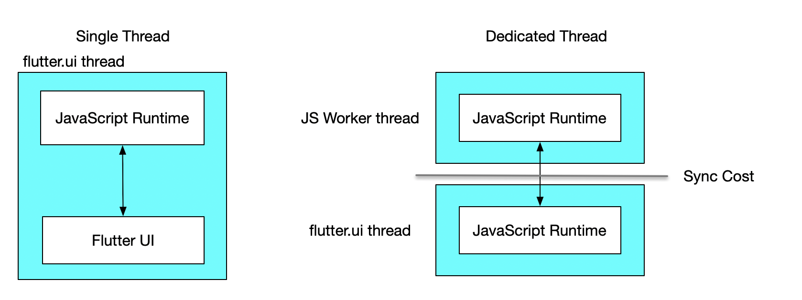

# Dedicated Thread Mode

In previous versions of WebF, the JavaScript runtime was housed within the Flutter UI thread. Extended JavaScript
execution could lead to UI jitters, making the app feel unresponsive.

To address this issue, we introduced dedicated thread mode. This mode shifts the JavaScript runtime to a dedicated
thread, ensuring that lengthy JavaScript processes do not interfere with Flutter UI animations or gesture
responsiveness.

## Enabling Dedicated Thread Mode in WebF

As of version 0.16.0, dedicated thread mode is enabled by default.

If you update your WebF dependencies to version 0.16.0 or higher, no additional configuration is required.

### Advantages and Disadvantages of Dedicated Thread Mode

Dedicated thread mode lays the foundation for further optimizations in WebF. Our primary optimization goal is to
separate the execution of CSS/DOM and JavaScript between the layout and paint stages. Completing this separation opens
up more possibilities for advanced performance features such as pre-rendering, snapshotting, efficient scrolling lists,
and other enhancements.

### Disabling Dedicated Thread Mode

To revert to the single-threaded mode, set the runningThread parameter to an instance of `FlutterUIThread()`, which will
switch the JavaScript runtime back to the older version running on the Flutter UI thread:

```dart
WebFController(
  context,
  runningThread: FlutterUIThread(),
);
```

### Sharing a Single Thread Across Multiple WebF Instances

By default, each WebF instance operates on its own dedicated thread. If there's a need to run multiple WebF instances on
a single thread—for example, to leverage certain performance benefits—you can use the DedicatedThreadGroup class. This
class allows multiple WebF instances to share the same thread:

```dart
DedicatedThreadGroup group = DedicatedThreadGroup();
   
WebFController controller = WebFController(
  context,
  runningThread: group.slave(),
  devToolsService: ChromeDevToolsService(),
);
WebFController controller2 = WebFController(
  context,
  runningThread: group.slave(),
  devToolsService: ChromeDevToolsService(),
);
```

## How to Choose Between Dedicated-Threading or Single-Threading Mode

Different threading modes offer various advantages depending on the scenario.

It's difficult to categorize threading models simply as good or bad. In this section, we will explore the applicable scenarios for different threading modes and how to choose between them.



The advantage of single-thread mode is the efficient communication cost between the JavaScript runtime and the Flutter UI, especially if your apps contain a lot of JavaScript-controlled animations.

However, the disadvantage of single-thread mode is still obvious—any execution of JavaScript will block the running of Dart, affecting animations and gesture handling.

If your application does not require significant JavaScript runtime and it does not noticeably affect the running of the Flutter UI, using single-thread mode is a good choice. Additionally, it helps reduce delays in JavaScript animation states relative to the actual UI results.

On the other hand, dedicated-threading mode is the counterpart of single-threading mode, where JavaScript execution won't block Dart execution unless necessary. However, the downside is the increased time for cross-thread synchronization.

But in most scenarios, especially for Vue or React users, using dedicated-threading mode is a preferred choice most of the time.