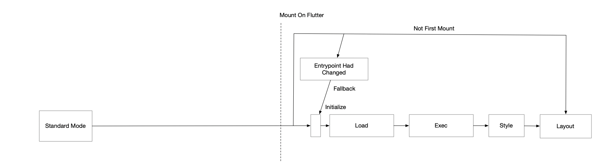
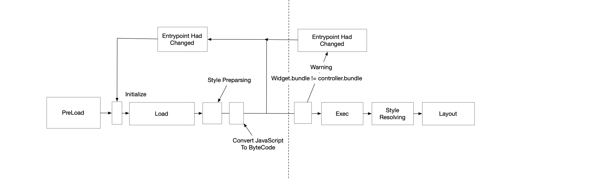
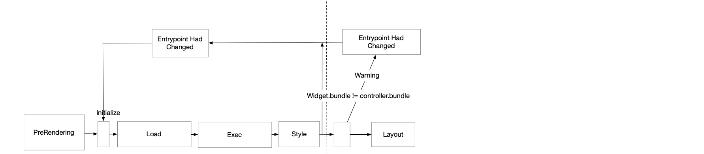

PreRendering and Preload Mode is the ultimate optimization method in WebF to speed up page load performance.

## Core Concepts

There are five phases in WebF for a page from loading to displaying the actual results:

1. Loading
2. Exec
3. Style
4. Layout
5. Paint

### Loading

The Loading phase indicates the time cost used by the network or disk to load necessary resources for page load, like HTML/CSS, JavaScript, or Images.

Loading from the network is much more flexible but takes more time.

On the other hand, loading from memory could be the fastest approach but often requires another strategy for additional management.

In the end, all resources including HTML/CSS and JavaScript will be loaded into memory.

### Exec

After all resources have been loaded, the WebF core will parse and execute them.

This includes parsing HTML/CSS/JavaScript and executing the JavaScript code. At this stage, the DOM Tree is created, and all CSS stylesheets are parsed into CSS style rules.

In the end, the JavaScript code will be fully executed, and both the DOM tree and CSS rules will have been constructed.

### Style

When the DOM tree and CSS rules are ready, in this stage, WebF matches each element with CSS rules to determine each element's style.

Matching CSS rules involves walking the DOM tree nodes to find how elements satisfy the CSS selector rules and parsing CSS functions and variables.

Different CSS rules directly affect the creation of the RenderObject, which is prepared for the next stage.

In the end, all elements will have an array of their resolved styles ready for the next stage.

### Layout

The layout phase in WebF is a subset of Flutter's layout phases.

Each RenderObject gets its `performLayout()` called, and each RenderObject needs to calculate the `constraints` for its children and also calculate its size for the parent.

When the size of a RenderObject is confirmed, determining each RenderObject's relative position is another important task in layout.

In the end, each RenderObject will have received its size and offset as a result.

### Paint

The paint phase in WebF is a subset of Flutter's paint phases.

When the size and offset are ready, the canvas painter can paint the actual contents based on the offset of RenderObjects.

The border-radius, opacity, and transform CSS properties will affect the behavior of the actual painting.

## The Standard Load Mode

The standard mode is the loading mode for older versions of WebF, where the WebF widget, upon mounting in the Flutter tree, will start at the loading phase and run through all the phases step by step.



## The Preload Mode

Beginning with version 0.16.0, the preload mode has been set as the default loading mode.

The preload mode preloads remote resources into memory and waits for execution before the WebF widget is mounted into the Flutter tree.

If the entry point is an HTML file, the HTML will be parsed, and its elements will be organized into a DOM tree. CSS files loaded through `<style>` and `<link>` elements will be parsed, and the calculated styles applied to the corresponding DOM elements.

However, JavaScript code will not be executed in this mode.

If the entry point is a JavaScript file, WebF only performs loading until the WebF widget is mounted into the Flutter tree.

Using this mode can save up to 50% of loading time while maintaining 100% compatibility with the standard mode.



Here is an example of using preload mode to load the page:

```dart
controller = WebFController(
  context,
);
controller.preload(WebFBundle.fromUrl('assets:assets/bundle.html'));
```

## The PreRendering Mode

The PreRendering mode goes a step further than preloading, cutting down up to 90% of loading time for optimal performance.

This mode simulates the instantaneous response of native Flutter pages but may require modifications in existing web codes for compatibility.

In this mode, all remote resources are loaded and executed similarly to the standard mode, but with an offline-like behavior.

Given that JavaScript is executed in this mode, properties like clientWidth and clientHeight from the viewModule always return 0.

This is because no layout or paint processes occur during preRendering.

If your application depends on viewModule properties, ensure that the related code is placed within the `load` and `DOMContentLoaded` event callbacks of the window.

These callbacks are triggered once the WebF widget is mounted into the Flutter tree.

Apps optimized for this mode remain compatible with both standard and preloading modes.



```dart
controller = WebFController(
  context,
);
controller.preRendering(WebFBundle.fromUrl('assets:assets/bundle.html'));
```